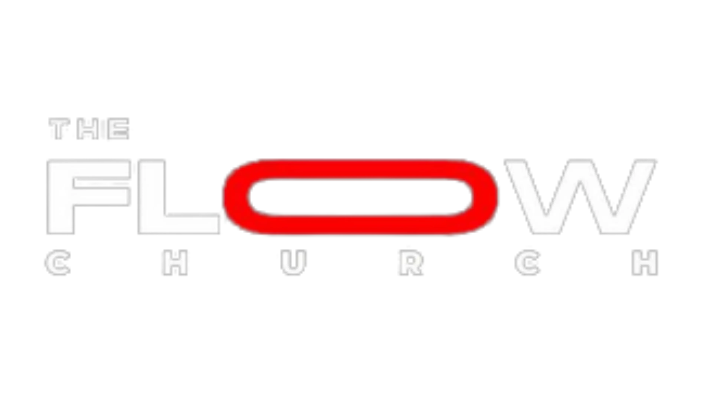

<p align="center"><a href="https://laravel.com" target="_blank"></a></p>

## About Flow Clicks

Flow Clicks is a link shortner/tracker for the FLOW Church.
- Create short shareble links for flow church events
- Get analytics on clicks for links
- Get clicks data

Laravel is accessible, powerful, and provides tools required for large, robust applications.

## Local for Devs
1. Clone the project
```bash
git clone https://github.com/josephomills/flow-clicks.git
```

2. Create your .env file
```bash
cp .env.example .env
```

3. Generate the APP_KEY

```bash
php artisan generate:key
```


4. Install php dependencies
```bash
composer install
```
5. Install npm dependencies
```bash
npm install
```
OR - Install from package.lock
```bash
npm co
```
## Start Local Server
```bash
composer run dev
```

## Code of Conduct

In order to ensure that the app is kept running, all developers must and abide by the [Code of Conduct](code-of-conduct.md).

## License

The Laravel framework is open-sourced software licensed under the [MIT license](https://opensource.org/licenses/MIT).
